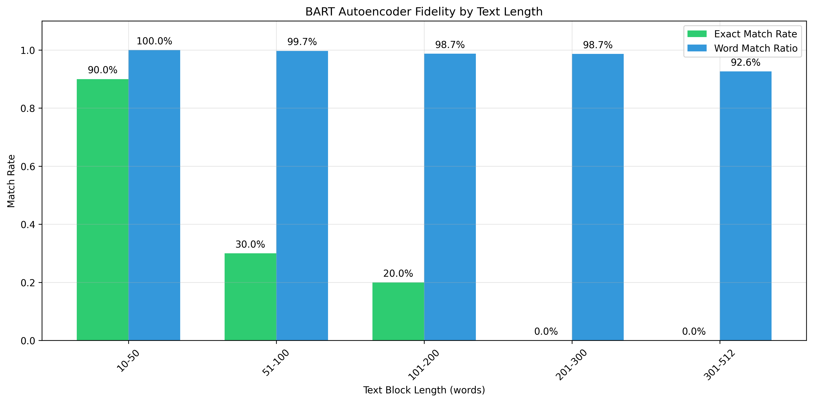

To make a VAE I need an encoder and a decoder. I tested SBERT and then BART encoders.

We can easily roll our own I think but there's a paper called Optimus https://arxiv.org/abs/2004.04092 https://github.com/ChunyuanLI/Optimus that shows a text VAE and they use Bert for encoding and GPT-2 for decoding. 

# SBERT encoding 
From SBERT (https://sbert.net) we have "A wide selection of over [10,000 pre-trained Sentence Transformers models](https://huggingface.co/models?library=sentence-transformers) are available for immediate use on 🤗 Hugging Face." SBERT is for sentence encoding—pretty much just what we want.

I did a little test of SBERT:
```
Similarity between:
1. 'The cat sat on the mat'
2. 'A feline rested on the carpet'
Similarity score: 0.5686

Similarity between:
1. 'The cat sat on the mat'
2. 'The stock market crashed today'
Similarity score: 0.0940

Similarity between:
1. 'A feline rested on the carpet'
2. 'The stock market crashed today'
Similarity score: 0.0534

Embedding dimension: 384
```

These results are great; similar sentences have high similarity, dissimilar sentences have miniscule similarity.

However, SBERT is intended for sentiment and similarity analysis. Although all we need is encoded latents, training my own decoder might be avoidable.

# BART Autoencoding Analysis

Gemini recommended the BART decoder https://huggingface.co/docs/transformers/en/model_doc/bart which was introduced in BART: Denoising Sequence-to-Sequence Pre-training for Natural Language Generation, Translation, and Comprehension, Lewis et al, 2019 (https://arxiv.org/abs/1910.13461). Since we're doing a seq2seq task this may be more ideal. The 768-dimensional space is richer than SBERT's 384-dimensional space, but I did notice that similar sentences have a high similarity of 0.87 and dissimilar sentences also have a high similarity of about 0.6. Hopefully this doesn't impact the VAE's performance.

## BART context length analysis

How large of a block size should we use? We tested BART's ability to encode and then reconstruct text blocks of different lengths (10-512 words) and measured two key metrics:
1. Exact Match Rate: Percentage of blocks that are reconstructed perfectly
2. Word Match Ratio: Percentage of original words preserved in the reconstruction

## Results

The analysis shows a clear relationship between text length and reconstruction fidelity:

- **Short Blocks (10-50 words)**: 
  - 90% exact match rate
  - 100% word match ratio
  - Ideal for high-fidelity autoencoding

- **Medium Blocks (51-100 words)**:
  - 30% exact match rate
  - 99.7% word match ratio
  - Good word preservation with some reordering

- **Long Blocks (101-300 words)**:
  - 0-20% exact match rate
  - 98.7% word match ratio
  - High word preservation but significant reordering

- **Very Long Blocks (301-512 words)**:
  - 0% exact match rate
  - 92.6% word match ratio
  - Noticeable degradation in word preservation



So we can expect good performance up until 300 tokens, probably.

# But both models are autoregressive

From the demos of diffusion LLMs I've seen, the decoding process looks like it's done in one pass, not autoregressively. Reading Diffusion-LM (2022), I see that the latent is a sequence of embeddings, not a single vector; each embedding decodes noisily (is "rounded off") to a token.

For the moment I'll pursue autoregressive decoding. Even though it won't work it should be fun and educational.